# Terraform AWS Custom VPC Infrastructure

Infrastructure as Code (IaC) project that provisions a secure AWS network using **Terraform**.

This project recreates my manually built AWS Custom VPC architecture (Project 3) entirely through Terraform, demonstrating how Infrastructure as Code can automate networking, security, and compute provisioning in AWS.

---

## Project Overview

This Terraform configuration deploys:

- Custom VPC
- Public Subnet
- Private Subnet
- Internet Gateway
- Public Route Table
- Route Table Association
- Bastion Host
- Private EC2 Instance
- Security Groups
- Terraform Outputs

The deployment follows AWS networking best practices by exposing only the Bastion Host to the Internet while keeping the application server inside a private subnet.

---

## Architecture

<p align="center">
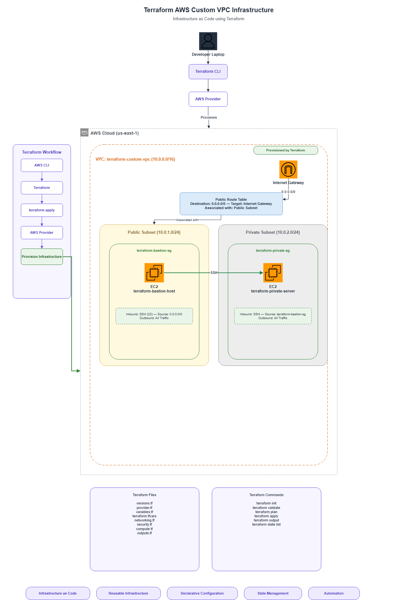
</p>

---

## Technologies Used

- Terraform
- AWS CLI
- Amazon VPC
- Amazon EC2
- AWS IAM
- SSH
- Ubuntu Server
- Git
- GitHub

---

## Project Structure

```
terraform-aws-custom-vpc/

│

├── Architecture/

├── Screenshots/

├── terraform/

│ ├── versions.tf

│ ├── provider.tf

│ ├── variables.tf

│ ├── terraform.tfvars

│ ├── networking.tf

│ ├── security.tf

│ ├── compute.tf

│ └── outputs.tf

│

├── README.md

└── LICENSE
```

---

# Infrastructure Created

Terraform provisions:

- VPC (10.0.0.0/16)

- Public Subnet (10.0.1.0/24)

- Private Subnet (10.0.2.0/24)

- Internet Gateway

- Public Route Table

- Bastion Host

- Private EC2 Instance

- Bastion Security Group

- Private Security Group

---

# Deployment Workflow

## 1. Install Terraform


---

## 2. Configure AWS CLI

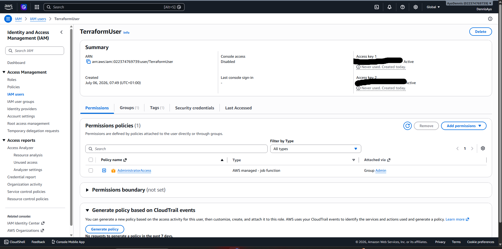

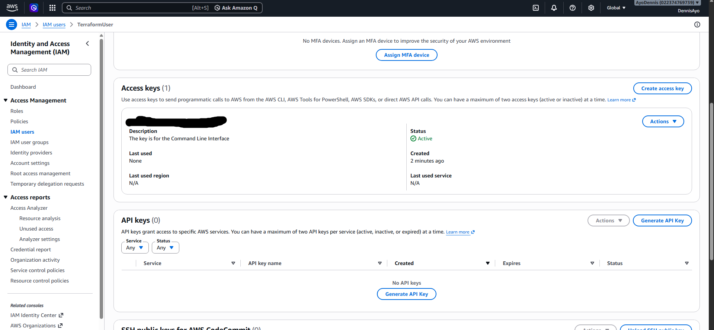

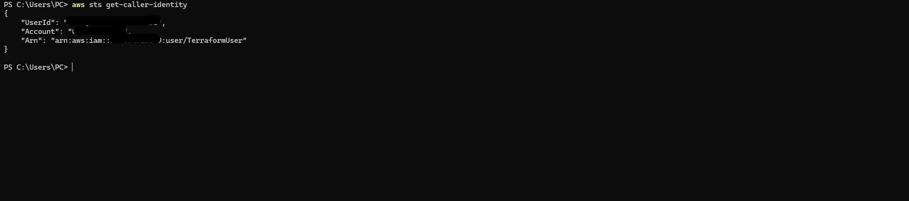

---

## 3. Initialize Terraform

```bash
terraform init
```

---

## 4. Validate Configuration

```bash
terraform validate
```

---

## 5. Review Infrastructure Changes

```bash
terraform plan
```

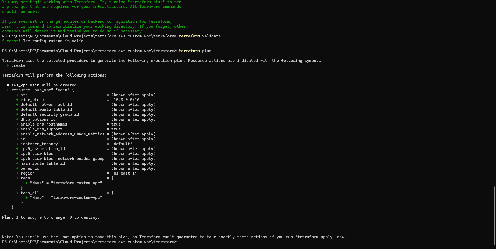

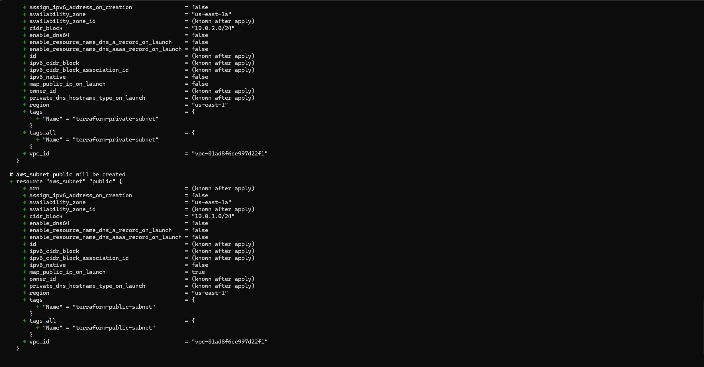

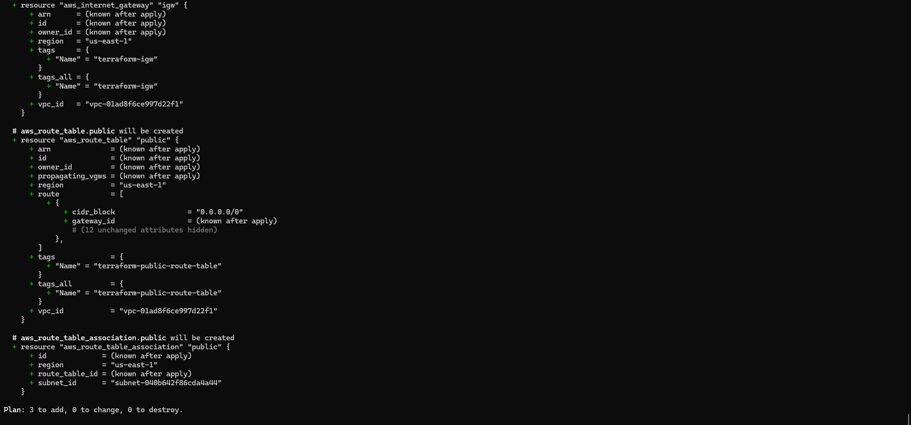

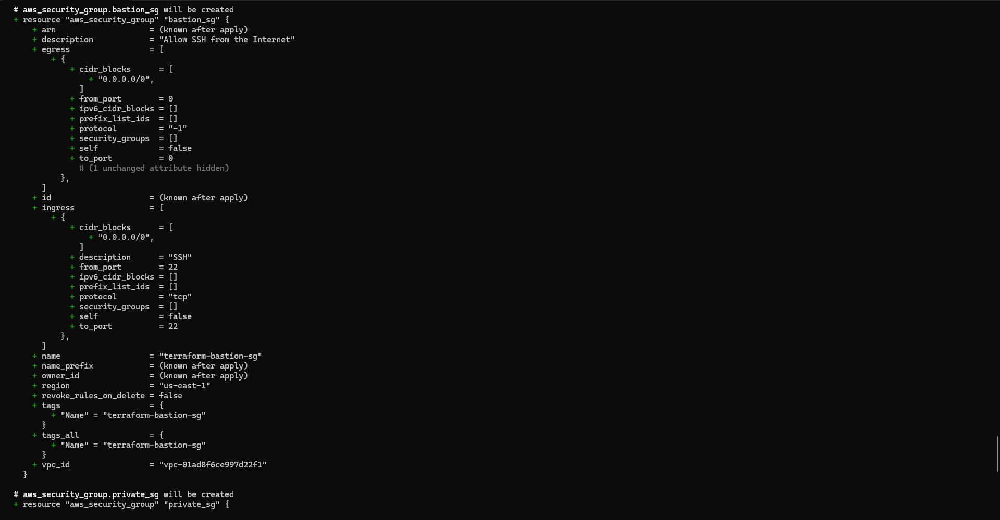

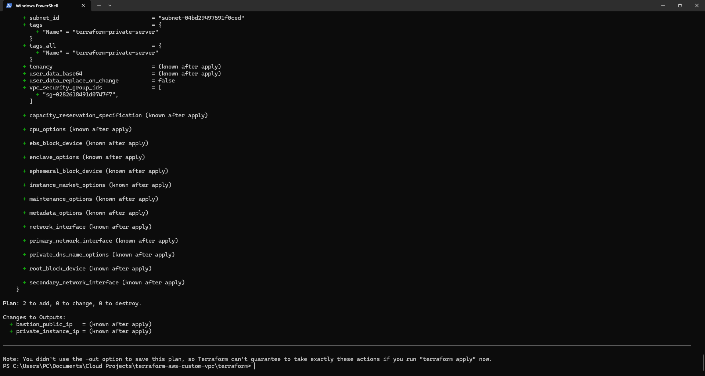

---

## 6. Deploy Infrastructure

```bash
terraform apply
```

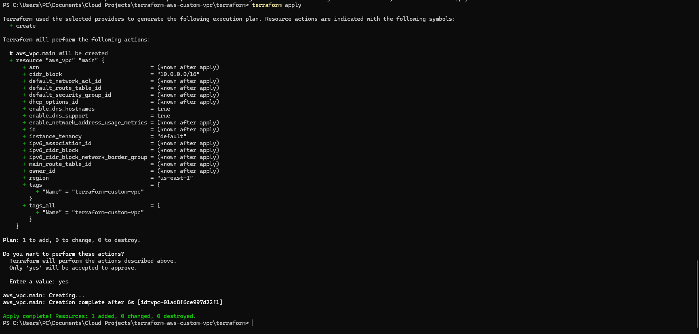

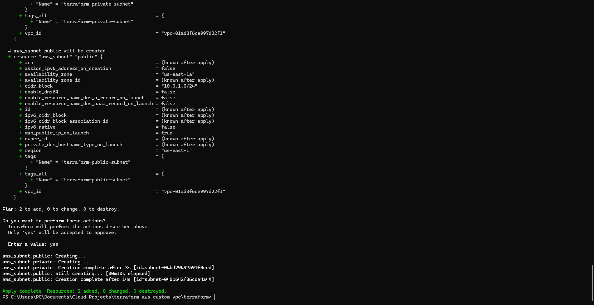

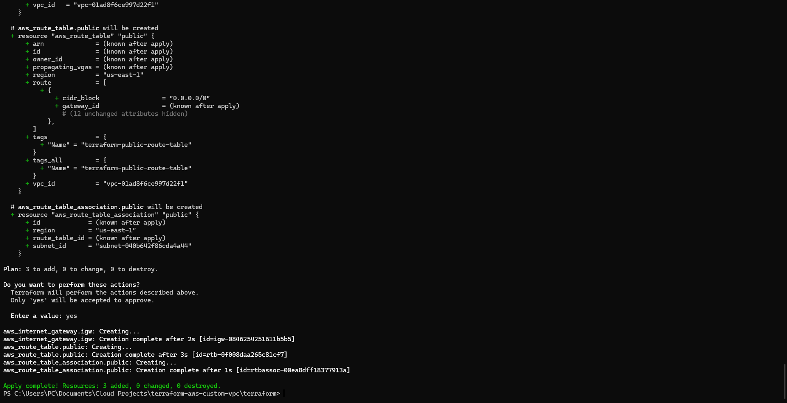

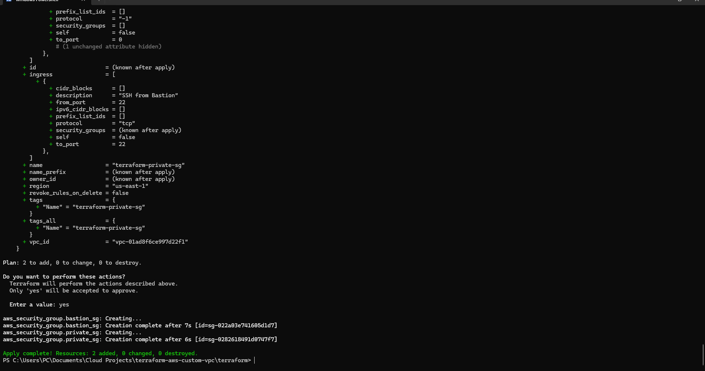

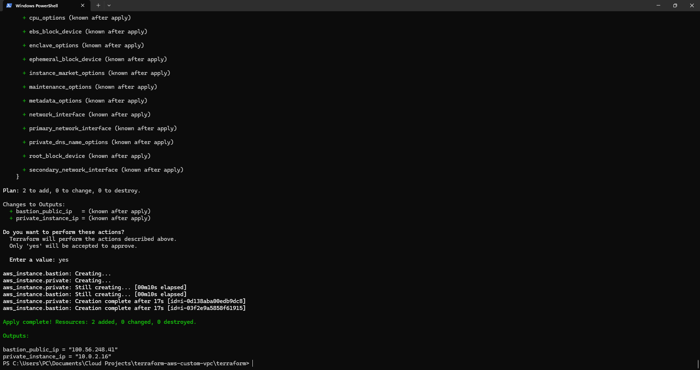

---

## 7. Verify Resources

### VPC

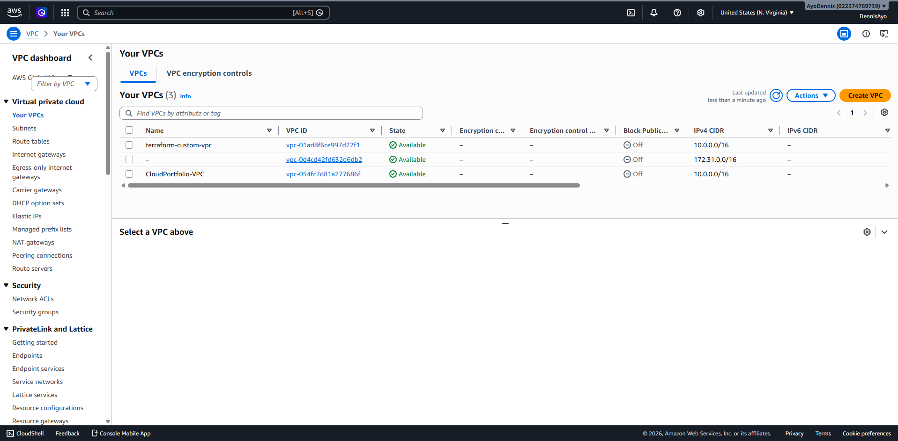

### Subnets

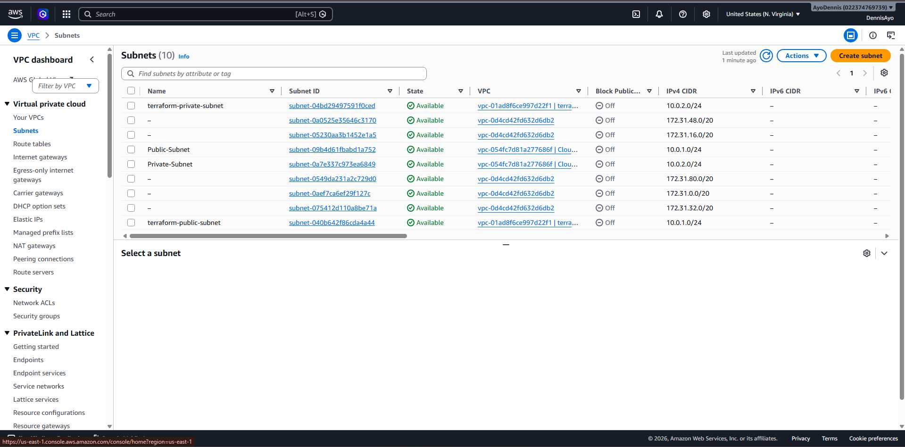

### Networking

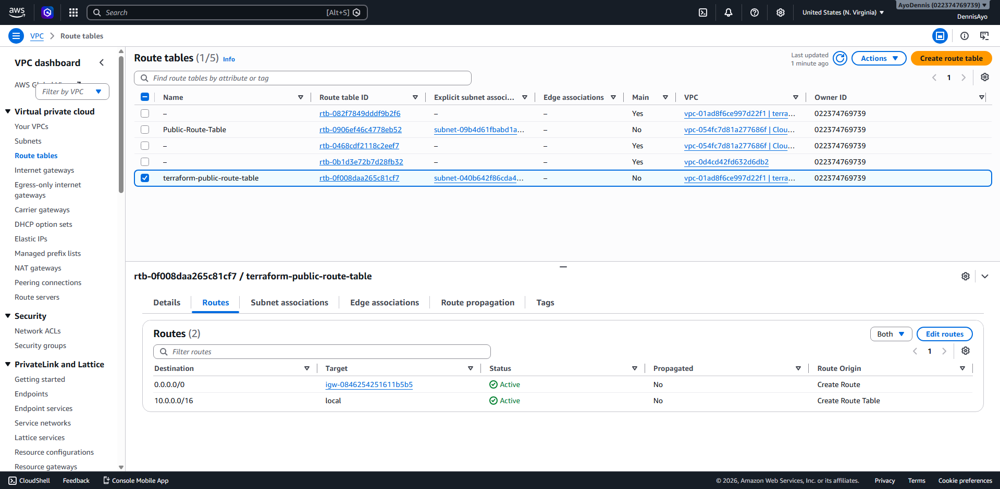

### Security Groups

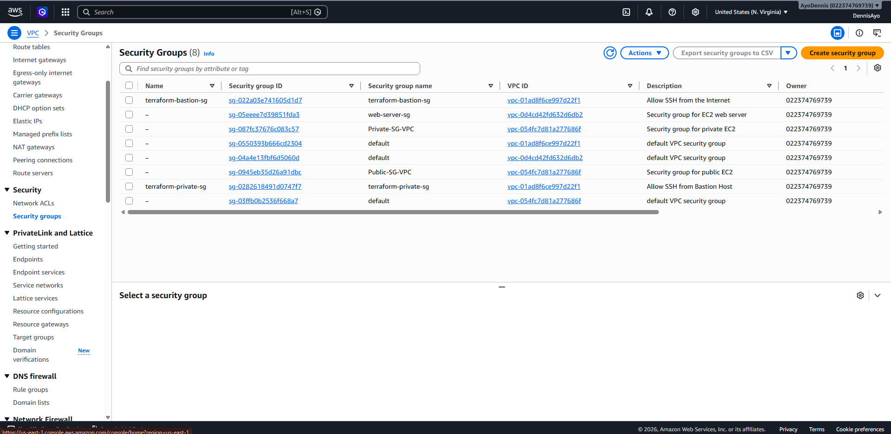

---

## 8. Terraform Outputs

```bash
terraform output
```

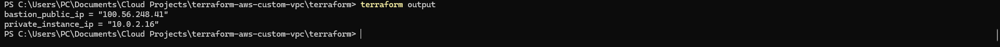

---

## 9. Terraform State

```bash
terraform state list
```

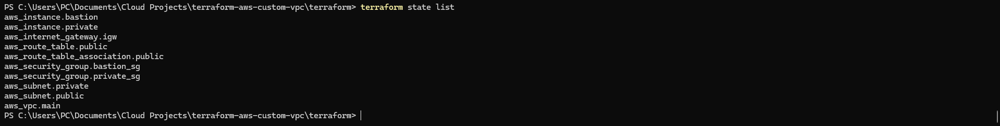

---

## 10. Connectivity Test

SSH from:

Laptop

↓

Bastion Host

↓

Private EC2

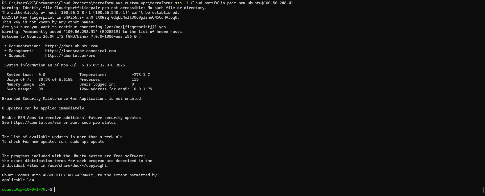

This validates:

- Public subnet connectivity
- Private subnet isolation
- Bastion Host architecture
- Security Group configuration

---

# Manual AWS vs Terraform

| Manual AWS Console | Terraform |
|-------------------|-----------|
| Click through console | Infrastructure defined as code |
| Difficult to reproduce | Fully repeatable deployment |
| Manual configuration | Automated provisioning |
| Hard to version control | Version controlled with Git |
| Error-prone | Consistent deployments |

---

# Security

- Private EC2 is not publicly accessible.
- Bastion Host provides controlled SSH access.
- Security Groups enforce least privilege.
- Infrastructure can be recreated from source code.
- AWS credentials are managed through the AWS CLI.

---

# Key Terraform Commands

```bash
terraform init
terraform validate
terraform plan
terraform apply
terraform output
terraform state list
terraform destroy
```

---

# Skills Demonstrated

- Infrastructure as Code (IaC)
- Terraform
- AWS Networking
- Amazon VPC
- EC2 Deployment
- Security Groups
- Route Tables
- Internet Gateway
- SSH
- AWS CLI
- Git
- GitHub

---

# Learning Outcomes

Through this project I learned how to:

- Build AWS infrastructure using Terraform
- Organize Terraform projects into reusable modules/files
- Authenticate Terraform using AWS CLI
- Manage Terraform state
- Validate infrastructure before deployment
- Automate networking and compute provisioning
- Verify deployed infrastructure using SSH

---

## Author

**Dennis Owoju**

Aspiring Cloud Engineer | Cybersecurity Enthusiast | AWS Certified Cloud Practitioner (In Progress)

GitHub:

https://github.com/owojudennis-lab
